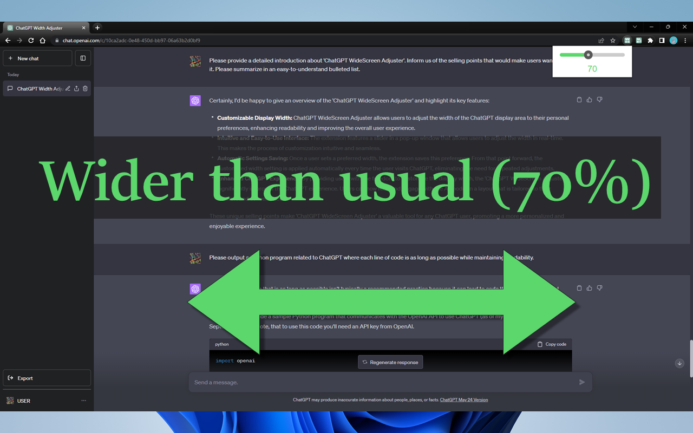
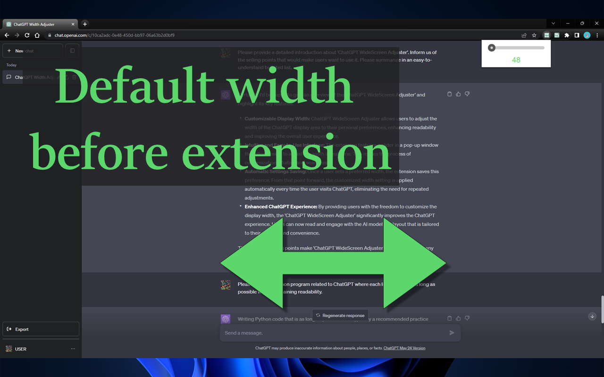
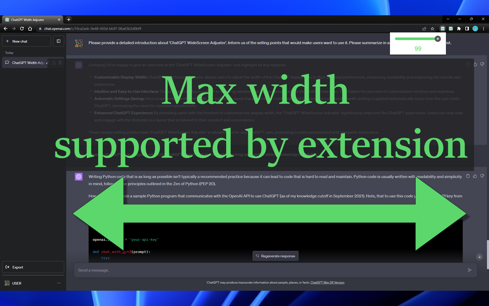

# ChatGPT WideScreen Adjuster

English | [日本語](README_JA.md) | [简体中文](README_CH.md)

## Overview

"**ChatGPT WideScreen Adjuster**" is a Chrome extension that allows you to freely adjust the width of the display area in ChatGPT. Say goodbye to the fixed width text fields and enhance your reading experience by customizing the width to your preference.

## Chrome Web Store page

<https://chrome.google.com/webstore/detail/chatgpt-widescreen-adjust/ioimfefhpfjpifdfijgjnbiojlneeiac>

## Features

* **Freely adjust the width**: Customize the width of the ChatGPT display area according to your preference.
* **Easy operation**: Adjust the display area's width instantly by simply moving the slider in the extension popup.
* **Save settings**: Your chosen width setting is automatically saved and will be applied from the next session onward.

Experience a more comfortable ChatGPT session with "ChatGPT WideScreen Adjuster".

## Visual Preview

<table>
  <tr>
    <td></td>
    <td></td>
  </tr>
  <tr>
    <td></td>
    <td></td>
  </tr>
</table>
