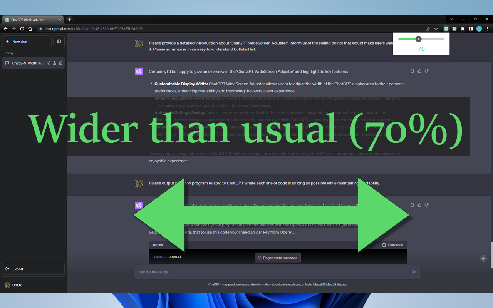
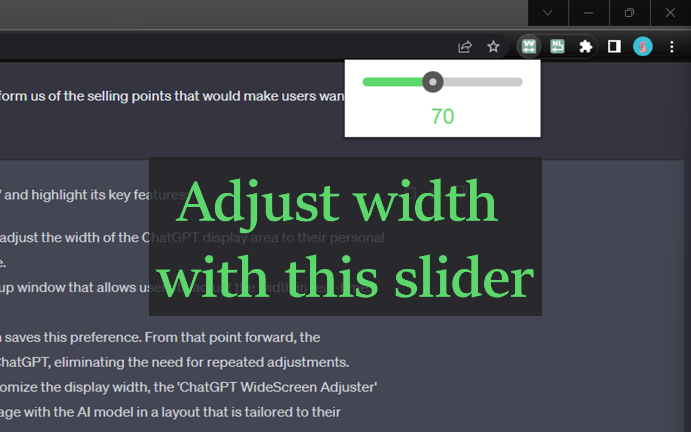

# ChatGPT WideScreen Adjuster

[English](README.md) | [日本語](README_JA.md) | 简体中文

## 概述

"**ChatGPT WideScreen Adjuster**" 是一个 Chrome 扩展，允许您自由调整 ChatGPT 显示区域的宽度。告别固定宽度的文本字段，通过自定义宽度来增强您的阅读体验。

## Chrome 网上应用店 页面

<https://chrome.google.com/webstore/detail/chatgpt-widescreen-adjust/ioimfefhpfjpifdfijgjnbiojlneeiac>

## 特性

* **自由调整宽度**：根据您的喜好自定义 ChatGPT 显示区域的宽度。
* **易于操作**：通过简单移动扩展弹窗中的滑块，即可立即调整显示区域的宽度。
* **保存设置**：您选择的宽度设置将自动保存，并将在下次会话开始时应用。

使用 "ChatGPT WideScreen Adjuster" 享受更舒适的 ChatGPT 会话。

## 视觉预览

<table>
  <tr>
    <td></td>
    <td></td>
  </tr>
  <tr>
    <td></td>
    <td></td>
  </tr>
</table>
