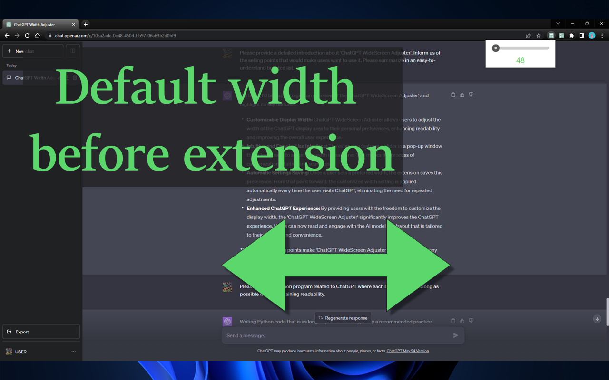

# ChatGPT WideScreen Adjuster

[English](README.md) | 日本語 | [简体中文](README_CH.md)

## 概要

"**ChatGPT WideScreen Adjuster**" は、ChatGPT の表示エリアの幅を自由に調整できる Chrome 拡張機能です。固定されたテキストフィールドの幅から解放され、読みやすさを向上させるために、自分の好みに合わせて幅をカスタマイズできます。

## Chrome ウェブストアページ

<https://chrome.google.com/webstore/detail/chatgpt-widescreen-adjust/ioimfefhpfjpifdfijgjnbiojlneeiac>

## 機能

* **幅を自由に調整**：あなたの好みに合わせて、ChatGPT の表示エリアの幅をカスタマイズできます。
* **簡単な操作**：拡張機能のポップアップ内のスライダーを動かすだけで、表示エリアの幅を瞬時に調整できます。
* **設定の保存**：調整した幅は自動的に保存され、次回からはその設定が適用されます。

"ChatGPT WideScreen Adjuster" で、より快適な ChatGPT 体験をお楽しみください。

## 外観

<table>
  <tr>
    <td></td>
    <td></td>
  </tr>
  <tr>
    <td></td>
    <td></td>
  </tr>
</table>
